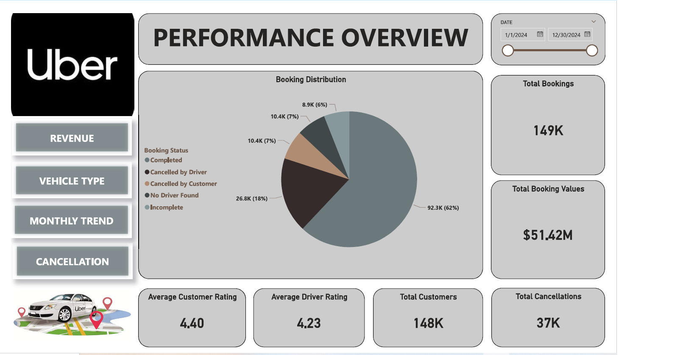
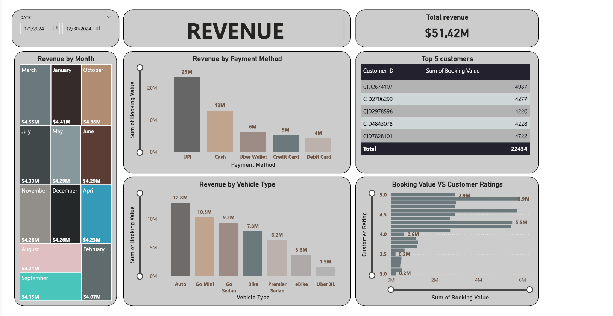
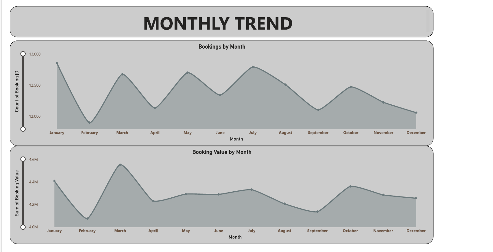
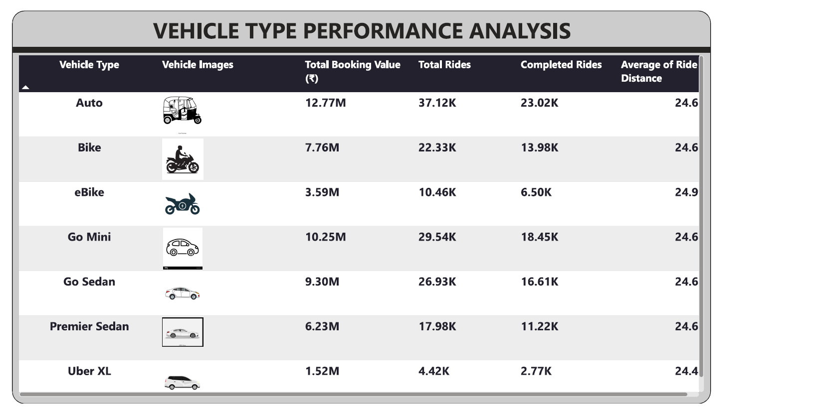
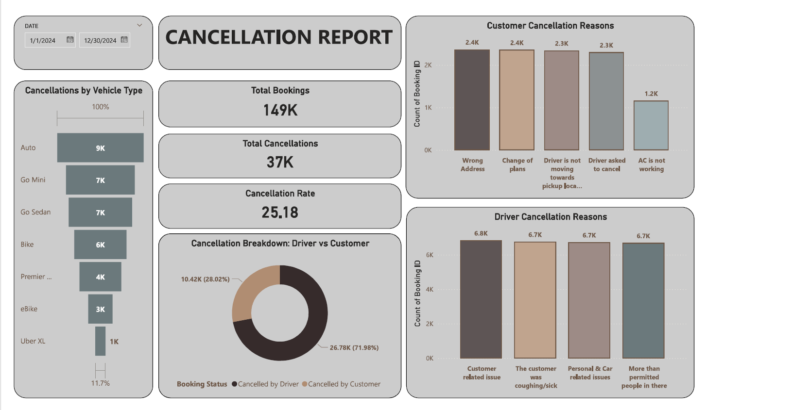

# 🚖 Uber Ride Booking Dashboard (Power BI)

## 📘 Project Overview
This project analyzes **Uber ride booking data (2024)** using **Power BI**.This comprehensive dataset contains detailed ride-sharing data from Uber operations for the year 2024, providing rich insights into booking patterns, vehicle performance, revenue streams, cancellation behaviors, and customer satisfaction metrics.
The dataset captures 148,770 total bookings across multiple vehicle types and provides a complete view of ride-sharing operations including successful rides, cancellations, customer behaviors, and financial metrics.

---

## 📊 Dataset Schema

| **Column Name**                | **Description**                                                                 |
|--------------------------------|---------------------------------------------------------------------------------|
| Date                           | Date of the booking                                                             |
| Time                           | Time of the booking                                                             |
| Booking ID                     | Unique identifier for each ride booking                                         |
| Booking Status                 | Status of booking (Completed, Cancelled by Customer, Cancelled by Driver, etc.) |
| Customer ID                    | Unique identifier for customers                                                 |
| Vehicle Type                   | Type of vehicle (Go Mini, Go Sedan, Auto, eBike/Bike, UberXL, Premier Sedan)    |
| Pickup Location                | Starting location of the ride                                                   |
| Drop Location                  | Destination location of the ride                                                |
| Avg VTAT                       | Average time for driver to reach pickup location (in minutes)                   |
| Avg CTAT                       | Average trip duration from pickup to destination (in minutes)                   |
| Cancelled Rides by Customer    | Customer-initiated cancellation flag                                            |
| Reason for cancelling by Customer | Reason for customer cancellation                                             |
| Cancelled Rides by Driver      | Driver-initiated cancellation flag                                              |
| Driver Cancellation Reason     | Reason for driver cancellation                                                  |
| Incomplete Rides               | Incomplete ride flag                                                            |
| Incomplete Rides Reason        | Reason for incomplete rides                                                     |
| Booking Value                  | Total fare amount for the ride                                                  |
| Ride Distance                  | Distance covered during the ride (in km)                                        |
| Driver Ratings                 | Rating given to driver (1–5 scale)                                              |
| Customer Rating                | Rating given by customer (1–5 scale)                                            |
| Payment Method                 | Method used for payment (UPI, Cash, Credit Card, Uber Wallet, Debit Card)       |

---

## 🗂 Column Categorization
| **Category**            | **Columns** |
|----------------------   |-----------------------------------------------------------------------------|
| **Identifiers**         | Booking ID, Customer ID | 
| **Datetime**            | Date, Time | 
| **Status Flags**        | Booking Status, Cancelled Rides by Customer, Cancelled Rides by Driver, Incomplete Rides | 
| **Reasons (Text)**      | Reason for cancelling by Customer, Driver Cancellation Reason, Incomplete Rides Reason |
| **Ride Details**        | Vehicle Type, Pickup Location, Drop Location, Ride Distance |
| **Performance Metrics** | Avg VTAT (driver arrival time), Avg CTAT (trip duration) |
| **Financials**          | Booking Value |
| **Ratings**             | Driver Ratings, Customer Rating |
| **Payment**             | Payment Method | ---

## 📈 Dashboard Insights (2024)

### 🔹 Performance Overview
- Total Bookings: **10.4K**
- Revenue: **₹51.42M**
- Average Ratings: **Customer 4.40**, **Driver 4.23**
- Total Customers: **148K**
- Total Cancellations: **37K** (~25%)

 

---

### 🔹 Revenue Trends
- Highest revenue months: **March ($4.55M)**, **January ($4.41M)**, **October ($4.36M)**
- Payment Method contribution: **UPI (23M)**, **Cash (20M)**, followed by Wallet & Cards
- Vehicle Type contribution: **Auto (12.8M)**, **Go Mini (10.3M)**, **Go Sedan (9.3M)**

  
  

---

### 🔹 Vehicle Performance
- **Auto**: 37K rides, ₹12.77M revenue
- **Bike**: 22K rides, ₹7.76M revenue
- **Go Mini**: 29K rides, ₹10.25M revenue
- **Premier Sedan**: 18K rides, ₹6.23M revenue
- **Uber XL**: Lowest share (4.4K rides, ₹1.52M revenue)

---

### 🔹 Cancellation Analysis
- **Driver-related cancellations** dominate (~72%)
- Common customer reasons: wrong address, change of plans, driver not moving
- Common driver reasons: customer-related issues, over-capacity, personal/car issues

---

## 🎯 Potential Use Cases
- **Power BI Dashboards** → Visualize cancellations, trip durations, and customer satisfaction  
- **Customer Behavior Analysis** → Study payment preferences, cancellation reasons, and ride distances  
- **Driver Performance Metrics** → Evaluate VTAT, CTAT, and ratings  
- **Revenue Insights** → Track booking values and trends over time  

---
### 🧠 Conclusion  
The integration of Excel and Power BI enabled a comprehensive analysis of **Uber Ride Bookings (2024)**.  
Key findings include:

- Total Bookings reached **10.4K**, generating **₹51.42M** in revenue.  
- **Driver-related cancellations** dominated (~72%), highlighting operational challenges.  
- **UPI and Cash** were the most preferred payment methods, contributing the largest share of revenue.  
- **Auto and Go Mini** vehicles generated the highest booking values, while **Uber XL** had the lowest share.  
- Higher **customer ratings (4.5–5.0)** correlated strongly with higher booking values.  
- Monthly trends showed **March, January, and October** as peak revenue months.  

This project transformed complex ride booking data into clear, actionable insights on **customer behavior, driver performance, and revenue optimization**.

---
## 🚀 Getting Started
1. Clone this repository  
2. Load the dataset into Power BI or your preferred tool  
3. Use the schema and insights above to design dashboards or run analytics queries 

### 👩‍💻 Author  
Nivedha Sivakumar    

🌐 GitHub: NivedhaSiva  
💼 LinkedIn: [Nivedha Sivakumar](www.linkedin.com/in/nivedhasivakumar)  
📧 Email:  nivedha_sivalumar@outlook.com

If you found this project useful or have feedback, feel free to reach out!

 

---
